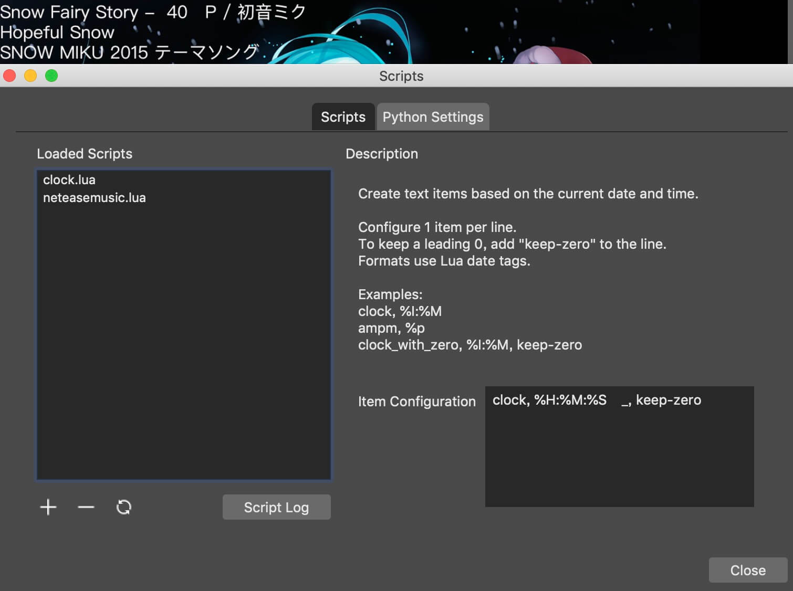

[中文文档](README-CN.md)

# OBS Netease Music Now Playing

This script can export some information of your Netease Music current track to OBS-Studio text source.

**!!!!! macOS ONLY !!!!!**

Avaliable data:

- Title
- Artists
- Alias
- Album

## Credits

- JSON decoder by [rxi/json.lua](https://github.com/rxi/json.lua) with MIT license
- Heavily inspired by [superlou/obs-newsroom](https://github.com/superlou/obs-newsroom)
